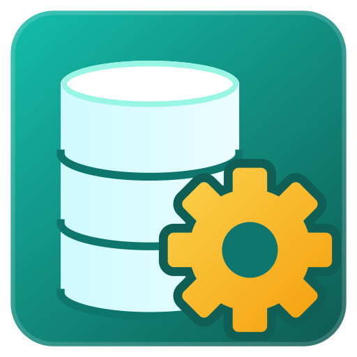
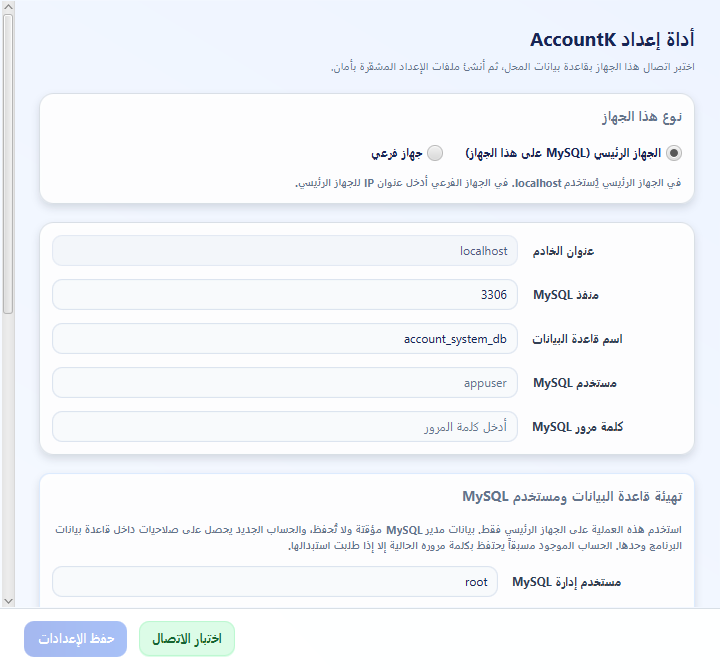
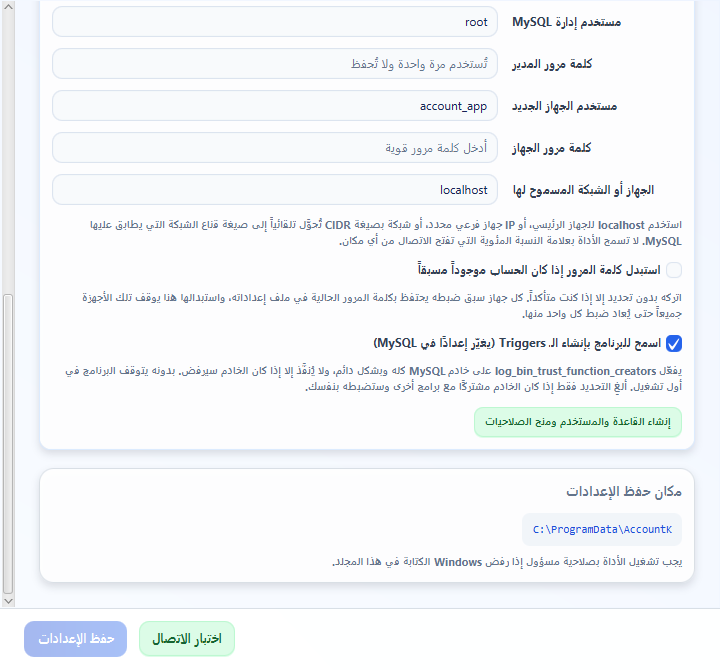
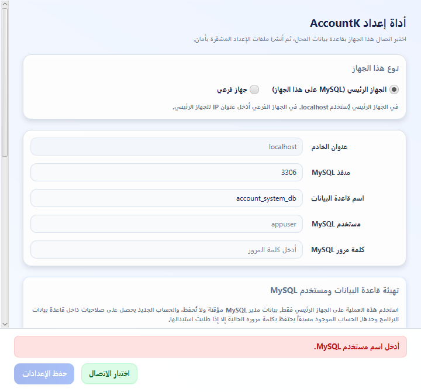
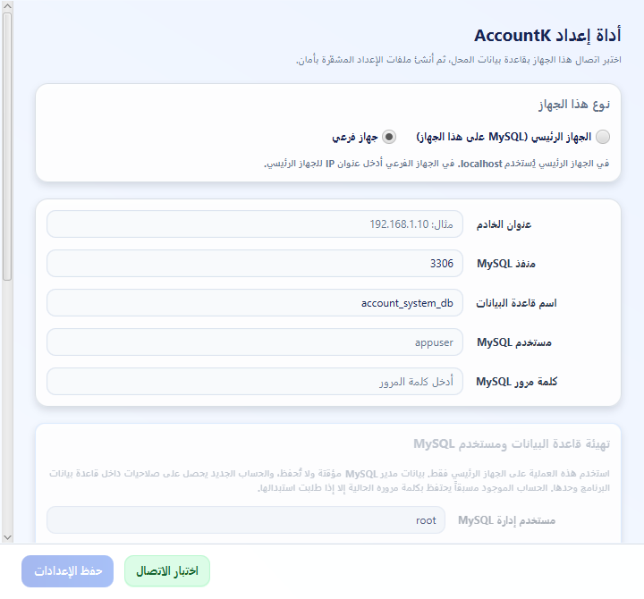

# دليل استخدام أداة إعداد قاعدة البيانات



**`AccountK-Database-Setup.exe`** أداة مستقلة تأتي مع برنامج AccountK في مجلد التثبيت نفسه، وأيقونتها
المربع الأخضر المائل إلى الزرقة (قاعدة بيانات وترس) لتمييزها عن أيقونة البرنامج. تقوم بعملين:

1. **تجهيز MySQL على الجهاز الرئيسي**: تنشئ قاعدة البيانات وحساب MySQL خاصًا بالبرنامج بصلاحيات
   محصورة في هذه القاعدة وحدها.
2. **إنشاء ملف الاتصال على كل جهاز**: تختبر الاتصال ثم تكتب `config.xml` مشفّرًا ومعه مفتاح التشفير
   `config.key` الخاص بالجهاز.

لا يحتاج جهاز العميل Java ولا Maven؛ الأداة تحمل ما تحتاجه معها.

> هذا الدليل للفنّي الذي يركّب البرنامج عند العميل. التفاصيل التقنية وطريقة سطر الأوامر للمطوّر في
> [`CONNECTION_SETUP.md`](CONNECTION_SETUP.md).

---

## قبل أن تبدأ

جهّز هذه الأمور مرة واحدة على **الجهاز الرئيسي** (الجهاز الذي عليه MySQL):

| المطلوب | لماذا |
|---|---|
| MySQL 8 مثبّت ويعمل | الأداة لا تثبّت MySQL، بل تجهّزه. |
| كلمة مرور `root` (أو أي حساب إدارة) | تُستخدم مرة واحدة لإنشاء القاعدة والحساب، ولا تُحفظ في أي ملف. |
| تشغيل الأداة **بصلاحية مسؤول** (Run as administrator) | لأنها تكتب في `C:\ProgramData\AccountK`. |

### إعداد في MySQL تضبطه الأداة بنفسها: `log_bin_trust_function_creators`

البرنامج ينشئ عند أول تشغيل جداوله ومعها **Triggers**. في MySQL 8 يكون السجل الثنائي (binary log)
مفعّلًا افتراضيًا، وفي هذه الحالة يرفض MySQL أن ينشئ حساب عادي (مثل الحساب الذي تنشئه الأداة) أي
Trigger ما لم يكن هذا الإعداد `1` — فيتوقف البرنامج في أول تشغيل برسالة فيها
`You do not have the SUPER privilege and binary logging is enabled` (الخطأ 1419).

**لا تحتاج أن تفعل شيئًا في الحالة العادية:** في قسم التهيئة خانة **«اسمح للبرنامج بإنشاء الـ Triggers
(يغيّر إعدادًا في MySQL)»** محدَّدة افتراضيًا. مع تحديدها يفحص زر «إنشاء القاعدة والمستخدم ومنح الصلاحيات»
الإعداد ويفعّله بحساب root (`SET PERSIST`، فيبقى بعد إعادة تشغيل MySQL) إذا كان الخادم سيرفض فقط، وتذكر
رسالة النجاح ذلك صراحةً. وزر «اختبار الاتصال» على أي جهاز يحذّرك إن كان الخادم ما زال سيرفض.

**لماذا خانة وليس تنفيذًا صامتًا؟** لأنه تخفيف دائم لقيد أمان على خادم MySQL كله، لا على قاعدة البرنامج
وحدها — وهو أوسع أثرًا من استبدال كلمة مرور حساب، الذي يحتاج هو أيضًا خانة صريحة. وهي محدَّدة افتراضيًا
لأن البرنامج لا يكمل أول تشغيل بدونه. ألغِ تحديدها فقط إذا كان MySQL مشتركًا مع برامج أخرى وتريد أن تقرر
بنفسك؛ عندها تُكمل الأداة تجهيز القاعدة والحساب، ولا تغيّر الإعداد، وتعرض تحذيرًا بالأمر المطلوب.

إن ظهر تحذير أن الأداة **لم تستطع** تفعيله (حساب الإدارة لا يملك الصلاحية)، أو ألغيت تحديد الخانة، فنفّذ
بنفسك مرة واحدة من `mysql` بحساب root على الجهاز الرئيسي:

```sql
SET PERSIST log_bin_trust_function_creators = 1;
```

للتحقق: `SELECT @@log_bin, @@log_bin_trust_function_creators;` — إذا ظهر `1` في العمود الثاني فالإعداد تمام.

### إذا كان هناك أكثر من جهاز

- **ثبّت عنوان IP للجهاز الرئيسي** (IP ثابت من الراوتر أو من إعدادات الشبكة). الأجهزة الفرعية تحفظ
  هذا العنوان في ملفها، فلو تغيّر توقفت كلها عن الاتصال.
- **افتح المنفذ 3306 في جدار حماية Windows على الجهاز الرئيسي** للشبكة المحلية فقط. من PowerShell
  بصلاحية مسؤول:

  ```powershell
  New-NetFirewallRule -DisplayName "MySQL 3306 (LAN)" -Direction Inbound -Protocol TCP -LocalPort 3306 -RemoteAddress LocalSubnet -Action Allow
  ```

- **اجعل المنطقة الزمنية نفسها على كل الأجهزة.** البرنامج يقرأ الأوقات بتوقيت الجهاز المحلي، فجهاز
  بمنطقة زمنية مختلفة يرى أوقات الفواتير والورديات مزاحة.

---

## السيناريو الأول: جهاز واحد فقط

الجهاز نفسه عليه MySQL وعليه البرنامج.

### الخطوة 1 — شغّل الأداة واختر «الجهاز الرئيسي»

اضغط بزر الفأرة الأيمن على `AccountK-Database-Setup.exe` واختر **Run as administrator**.
اترك الاختيار على **الجهاز الرئيسي (MySQL على هذا الجهاز)**؛ حقل «عنوان الخادم» يصبح `localhost` تلقائيًا
ولا يمكن تعديله.



### الخطوة 2 — جهّز القاعدة والحساب

انزل إلى قسم **تهيئة قاعدة البيانات ومستخدم MySQL** واملأ:

| الحقل | ماذا تكتب |
|---|---|
| مستخدم إدارة MySQL | `root` |
| كلمة مرور المدير | كلمة مرور root |
| مستخدم الجهاز الجديد | اسم حساب البرنامج، مثل `account_app` (حروف إنجليزية وأرقام و`_ . -` فقط) |
| كلمة مرور الجهاز | كلمة مرور قوية **12 حرفًا على الأقل** — احتفظ بها في مكان آمن |
| الجهاز أو الشبكة المسموح لها | `localhost` |

اترك خانة **«استبدل كلمة المرور إذا كان الحساب موجوداً مسبقاً»** فارغة، ثم اضغط
**إنشاء القاعدة والمستخدم ومنح الصلاحيات**.



> 💡 **نتيجة كل عملية تظهر في شريط ملوّن أسفل النافذة، فوق زرّي «اختبار الاتصال» و«حفظ الإعدادات»**:
> أخضر للنجاح، برتقالي لتنبيه يحتاج انتباهك، أحمر لخطأ. هذا الشريط والأزرار ثابتة لا تتحرك مع التمرير.
>
> 

عند النجاح تظهر رسالة خضراء «تم تجهيز قاعدة البيانات … والحساب …»، وقد يتبعها سطر «فُعِّل في MySQL الإعداد
log_bin_trust_function_creators…» إن احتاج الخادم ذلك. وتنسخ الأداة اسم الحساب وكلمته إلى حقلي الاتصال في
الأعلى تلقائيًا، ويُمسح حقل كلمة مرور المدير.

### الخطوة 3 — اختبر الاتصال ثم احفظ

1. اضغط **اختبار الاتصال**. يجب أن تظهر: «تم الاتصال بنجاح، وقاعدة البيانات موجودة ويمكن استخدامها».
2. يصبح زر **حفظ الإعدادات** متاحًا. اضغطه.
3. تظهر: «تم إنشاء config.xml وconfig.key بنجاح داخل: C:\ProgramData\AccountK».

زر الحفظ لا يعمل إلا بعد اختبار ناجح **بالقيم نفسها**؛ أي تعديل بعد الاختبار يعطّله حتى تختبر من جديد.
هذا مقصود حتى لا يُحفظ ملف لا يتصل.

### الخطوة 4 — شغّل البرنامج

شغّل `AccountK.exe`. في أول تشغيل ينشئ البرنامج الجداول بنفسه (قد يأخذ دقيقة)، ثم تظهر شاشة الدخول.
مستخدم البرنامج الافتراضي `admin` وكلمة مروره `admin`، ويطلب منك البرنامج تغييرها فورًا.

> مستخدم MySQL الذي أنشأته الأداة **ليس** مستخدم البرنامج. الأول اتصال تقني بقاعدة البيانات لا يراه
> أحد، والثاني (المدير، الكاشير…) يُدار من شاشة المستخدمين داخل AccountK.

---

## السيناريو الثاني: جهاز رئيسي وأجهزة فرعية

### على الجهاز الرئيسي

1. نفّذ **السيناريو الأول كاملًا** (الخطوات 1–4) بحساب `account_app` ومصدر `localhost`.
2. ارجع إلى قسم التهيئة وأعد العملية مرة ثانية لإعطاء الأجهزة الفرعية حق الاتصال:

   | الحقل | ماذا تكتب |
   |---|---|
   | مستخدم الجهاز الجديد | **نفس الاسم** `account_app` |
   | كلمة مرور الجهاز | كلمة المرور التي ستستخدمها الأجهزة الفرعية |
   | الجهاز أو الشبكة المسموح لها | شبكة المحل، مثل `192.168.1.0/24` — أو IP جهاز واحد مثل `192.168.1.25` |

   ثم **إنشاء القاعدة والمستخدم ومنح الصلاحيات**. العملية آمنة للتكرار: القاعدة الموجودة لا تُمسّ.

> ⚠️ **استخدم اسم مستخدم MySQL واحدًا لكل الأجهزة.** البرنامج يرفض استعادة نسخة احتياطية ما دام جهاز
> آخر متصلًا، ويعرف ذلك من قائمة اتصالات MySQL. لكن حساب MySQL العادي لا يرى في تلك القائمة إلا
> اتصالات **اسمه هو**. فلو أعطيت كل جهاز اسمًا مختلفًا (`account_cashier_01`، `account_cashier_02`…)
> لن يرى الجهاز الرئيسي الكاشير المتصل، وقد تُستعاد نسخة احتياطية فوق فواتير تُكتب في اللحظة نفسها.
> الاسم الواحد مع مصدرين مختلفين (`localhost` والشبكة) هو ما يُبقي هذه الحماية تعمل.

**كيف تكتب الشبكة؟** اكتب عنوان الشبكة وبعده `/24` (أو البادئة المناسبة). الأداة تحوّلها بنفسها إلى
الصيغة التي يفهمها MySQL (`192.168.1.0/255.255.255.0`). لاحظ:

- اكتب **عنوان الشبكة** وليس عنوان جهاز: `192.168.1.0/24` صحيح، و`192.168.1.25/24` مرفوض لأن MySQL
  لن يقبل به أي جهاز.
- لا تقبل الأداة `%` ولا `/0` لأنهما يفتحان القاعدة لأي جهاز في أي مكان.
- لا تعرف رقم شبكتك؟ نفّذ `ipconfig` على الجهاز الرئيسي: إذا كان `IPv4 Address` هو `192.168.1.10`
  و`Subnet Mask` هو `255.255.255.0` فالشبكة `192.168.1.0/24`.

### على كل جهاز فرعي

1. ثبّت AccountK، ثم شغّل `AccountK-Database-Setup.exe` **بصلاحية مسؤول**.
2. اختر **جهاز فرعي**. يصبح حقل «عنوان الخادم» فارغًا وقسم التهيئة معطّلًا (التهيئة تتم على الجهاز
   الرئيسي فقط).

   

3. املأ:

   | الحقل | ماذا تكتب |
   |---|---|
   | عنوان الخادم | IP الجهاز الرئيسي، مثل `192.168.1.10` |
   | منفذ MySQL | `3306` |
   | اسم قاعدة البيانات | `account_system_db` |
   | مستخدم MySQL | `account_app` |
   | كلمة مرور MySQL | كلمة مرور حساب الشبكة |

4. **اختبار الاتصال** ← **حفظ الإعدادات** ← شغّل `AccountK.exe`.

---

## معنى الرسائل وماذا تفعل

| الرسالة (تظهر أسفل الشاشة) | المعنى | ماذا تفعل |
|---|---|---|
| تم الاتصال بنجاح، وقاعدة البيانات موجودة | كل شيء سليم | اضغط «حفظ الإعدادات» |
| تم الاتصال بخادم MySQL، لكن قاعدة البيانات غير موجودة بعد | الحساب يعمل والقاعدة لم تُنشأ | على الجهاز الرئيسي نفّذ «إنشاء القاعدة والمستخدم»، أو احفظ ودع البرنامج ينشئها |
| تم الاتصال، لكن MySQL سيرفض إنشاء الـ Triggers… | الإعداد `log_bin_trust_function_creators` معطّل على الخادم | على الجهاز الرئيسي نفّذ «إنشاء القاعدة والمستخدم» فتفعّله الأداة، أو نفّذ الأمر المذكور في الرسالة بحساب root. يمكنك الحفظ الآن، لكن البرنامج لن يكمل أول تشغيل قبل ذلك |
| تنبيه: … ولم يستطع حساب الإدارة تفعيل log_bin_trust_function_creators | حساب الإدارة ليس root أو لا يملك صلاحية تغيير إعدادات الخادم | نفّذ `SET PERSIST log_bin_trust_function_creators = 1;` بحساب root |
| تنبيه: اخترت ألا تسمح بتغيير الإعداد… | ألغيت تحديد خانة «اسمح للبرنامج بإنشاء الـ Triggers» | نفّذ الأمر المذكور بحساب root عندما تقرر، أو أعد العملية والخانة محدَّدة |
| وصلنا إلى MySQL، لكن اسم المستخدم أو كلمة المرور غير صحيحين… | MySQL يعمل ويرفض الدخول | تحقّق من الكلمة، ومن أن الحساب أُنشئ لـ**هذا** الجهاز أو شبكته (مصدر الاتصال) |
| تعذر الوصول إلى MySQL… | لا اتصال بالخادم أصلًا | تأكد أن MySQL يعمل، وأن الـIP صحيح، وأن المنفذ 3306 مفتوح في جدار الحماية (اختبر: `Test-NetConnection 192.168.1.10 -Port 3306`) |
| اختبر الاتصال بهذه البيانات قبل حفظها | عدّلت حقلًا بعد الاختبار | اضغط «اختبار الاتصال» مرة أخرى |
| تعذر حفظ ملفات الإعداد… | لا صلاحية كتابة في المجلد | أغلق الأداة وشغّلها بـ Run as administrator |
| تعذر الدخول بحساب إدارة MySQL | كلمة مرور root خطأ | أعد كتابتها (تُمسح بعد كل محاولة) |
| حساب الإدارة لا يملك صلاحية إنشاء قاعدة أو مستخدم… | الحساب المستخدم ليس حساب إدارة كامل | استخدم `root` |
| رفض MySQL كلمة مرور مستخدم الجهاز… | سياسة كلمات المرور على الخادم أقوى | استخدم كلمة أطول فيها حروف كبيرة وصغيرة وأرقام ورموز |
| تم تجهيز … الحساب كان موجوداً مسبقاً فاحتفظ بكلمة مروره الحالية | الحساب قديم، ولم تُغيَّر كلمته | اكتب في حقول الاتصال كلمة مروره **القديمة** وليس المكتوبة في قسم التهيئة |
| تم تجهيز … واستُبدلت كلمة مرور الحساب | اخترت الاستبدال | أعد تشغيل الأداة على **كل** جهاز يستخدم هذا الحساب بالكلمة الجديدة |

---

## أسئلة متكررة

**أين تُحفظ الملفات؟**
في `C:\ProgramData\AccountK\`: `config.xml` (بيانات الاتصال مشفّرة) و`config.key` (مفتاح هذا الجهاز).
المسار الفعلي يظهر في قسم «مكان حفظ الإعدادات». يمكن تغييره بمتغير البيئة `ACCOUNT_CONFIG_DIR`.

**هل يضيع الملف القديم عند الحفظ مرة ثانية؟**
لا. قبل الاستبدال تأخذ الأداة نسخة مؤرخة بجواره، مثل `config.xml.backup-20260915-093000` ومعها
`config.key.backup-…`. ولو فشل الحفظ في منتصفه تعيد الملفات القديمة كما كانت.
هذه النسخ تتراكم؛ احذف القديم منها بعد أن تتأكد أن البرنامج يعمل، لأن كل نسخة تحمل كلمة مرور قديمة يمكن
فكّها بالمفتاح المحفوظ بجوارها.

**هل أنسخ `config.xml` من جهاز إلى آخر؟**
لا. شغّل الأداة على كل جهاز؛ كل جهاز يأخذ مفتاحه الخاص. ملف منسوخ بدون مفتاحه لن يُفتح.

**تغيّر IP الجهاز الرئيسي، ماذا أفعل؟**
على كل جهاز فرعي: شغّل الأداة، اختر «جهاز فرعي»، اكتب العنوان الجديد، اختبر واحفظ. وإذا كان حساب
الشبكة مسموحًا لشبكة كاملة (`/24`) ولم تتغير الشبكة نفسها فلا حاجة لأي تعديل على الجهاز الرئيسي.

**أضفت جهازًا فرعيًا جديدًا.**
إذا كان حساب الشبكة مسموحًا لـ `192.168.1.0/24` فالجهاز الجديد داخلها: اتبع خطوات «على كل جهاز فرعي»
فقط. وإذا كنت تسمح بعناوين محددة، فأضف IP الجهاز الجديد أولًا من قسم التهيئة على الجهاز الرئيسي.

**أريد تغيير كلمة مرور حساب MySQL.**
على الجهاز الرئيسي: قسم التهيئة بنفس الاسم والمصدر، اكتب الكلمة الجديدة، **حدّد** خانة الاستبدال،
ونفّذ. ثم على **كل** جهاز يستخدم ذلك الحساب: اختبر واحفظ بالكلمة الجديدة. الأجهزة التي لم تُحدَّث
ستتوقف عن الاتصال حتى تحدّثها.

**هل أستخدم `root` في ملف الاتصال مباشرة؟**
لا. `root` يملك كل الخادم؛ لو تسرّب ملف الاتصال تسرّب معه كل شيء. الحساب الذي تنشئه الأداة لا يلمس إلا
قاعدة البرنامج.

---

## ملاحظات أمان

- كلمة مرور المدير لا تُكتب في أي ملف ولا في السجلات، وتُمسح من الشاشة بعد كل عملية.
- الحساب المُنشأ يأخذ صلاحيات على `account_system_db.*` فقط، بلا `GRANT OPTION` وبلا صلاحيات على الخادم.
- التشفير يمنع قراءة الملف خارج الجهاز، لكن **أي مستخدم Windows على الجهاز نفسه يستطيع قراءة المفتاح
  والملف معًا**؛ فلا تعطِ حسابات Windows لأشخاص لا تثق بهم على الجهاز الرئيسي.
- لا تفتح المنفذ 3306 على الإنترنت أو في الراوتر؛ الشبكة المحلية فقط.
